# African Economic Pulse — A Modern Azure Data Pipeline

An end-to-end Azure data engineering project that ingests economic indicators (GDP, inflation, unemployment) from the World Bank API, processes them through a Medallion architecture (Bronze → Silver → Gold), serves them through Azure Synapse Analytics, visualizes them in Power BI, and layers on data governance and observability with Microsoft Purview and Azure Monitor.

The project was built and documented as a portfolio piece, with every architectural decision evaluated across **cost**, **complexity**, and **reliability** — and every mistake kept in, on purpose, as evidence of real troubleshooting.

---

## Table of Contents

- [Architecture Overview](#architecture-overview)
- [Tech Stack](#tech-stack)
- [Day 1 — Azure Setup & Architecture Decisions](#day-1--azure-setup--architecture-decisions)
- [Day 2 — Azure Data Factory Ingestion Pipeline](#day-2--azure-data-factory-ingestion-pipeline)
- [Day 3 — Databricks Silver & Gold Transformation](#day-3--databricks-silver--gold-transformation)
- [Azure Synapse Analytics — Serving Layer](#azure-synapse-analytics--serving-layer)
- [Power BI Dashboards](#power-bi-dashboards)
- [Microsoft Purview — Data Governance](#microsoft-purview--data-governance)
- [Azure Monitor & Log Analytics](#azure-monitor--log-analytics)
- [GitHub & Version Control](#github--version-control)
- [Key Learnings & Mental Models](#key-learnings--mental-models)
- [Mistakes Made (and Fixed)](#mistakes-made-and-fixed)
- [Production Enhancements](#production-enhancements-not-implemented-here)
- [Repository Structure](#repository-structure)

---

## Architecture Overview

```
World Bank API
      │
      ▼
Azure Data Factory  ──────►  Bronze (raw JSON, immutable, date-partitioned)
      │                            │
      │                            ▼
      │                     Databricks (PySpark)
      │                            │
      │                            ▼
      │                     Silver (cleaned, Africa-only, Delta Lake)
      │                            │
      │                            ▼
      │                     Gold (business-ready Parquet)
      │                            │
      ▼                            ▼
Microsoft Purview  ◄──────  Azure Synapse Serverless SQL (external tables + views)
(governance, lineage,              │
 asset catalogue)                  ▼
                              Power BI (3 dashboards)

Azure Monitor + Log Analytics ── observability across ADF pipeline runs
```

Every layer follows the **Medallion architecture**:


| Layer | Purpose | Characteristics |
|---|---|---|
| **Bronze** | Raw source data, exactly as received | Immutable, no transformations, system of record |
| **Silver** | Cleaned, standardized, Africa-only | Deduplicated, typed, quality-checked, Delta Lake |
| **Gold** | Business-ready datasets | Aggregated KPIs, country comparisons, Nigeria spotlight |

---

## Tech Stack

- **Ingestion:** Azure Data Factory (HTTP → ADLS Gen2)
- **Storage:** Azure Data Lake Storage Gen2 (Hierarchical Namespace)
- **Transformation:** Azure Databricks (PySpark, Delta Lake)
- **Serving:** Azure Synapse Analytics (Serverless SQL Pool)
- **Visualization:** Power BI
- **Governance:** Microsoft Purview
- **Observability:** Azure Monitor + Log Analytics (KQL)
- **Version Control:** GitHub (Git integration for both ADF and Databricks)

---

## Day 1 — Azure Setup & Architecture Decisions

**Resource Group & Region:** Deployed everything to **South Africa** keeps services co-located, minimizes latency and inter-region transfer costs, and is a realistic deployment region for an Africa-focused analytics project.

**Storage:** Created an ADLS Gen2 account with **Hierarchical Namespace (HNS)** enabled this is what turns plain Blob Storage into a real data lake: folders become actual directory objects, folder-level ACLs become possible, and Spark/Synapse performance improves.

**Identity & Access — RBAC:**

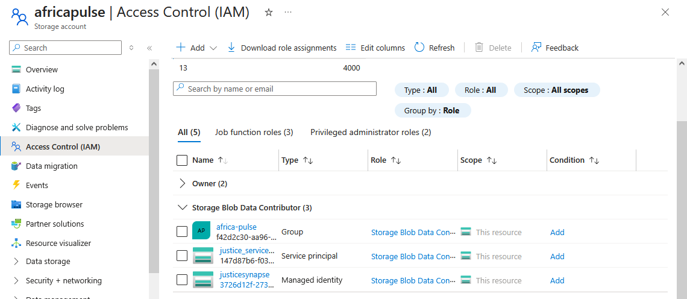

Assigned **Storage Blob Data Contributor** to:
- `africa-pulse` security group (manual/human access)
- `justice_service_principal` (ADF & Databricks programmatic access)
- Synapse Managed Identity (Serverless SQL Pool access)

Every Azure service that touches storage gets its own Managed Identity, granted the *minimum* required role this pattern repeats for ADF, Databricks, Synapse, and Purview throughout the project.

**RBAC vs ACL:** RBAC controls access at the resource level (storage account, container); ACLs control access at the folder/file level. RBAC is simpler to manage; ACLs are more fine-grained. In production, both are typically combined (e.g., Data Engineers: R/W on Bronze+Silver; Analysts: read-only on Gold).

**Git Integration for ADF:**

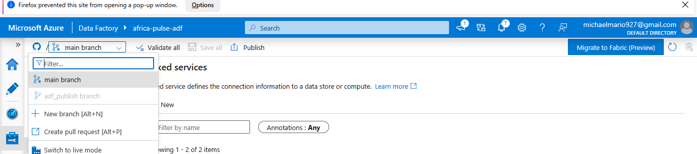

ADF pipelines are stored as JSON in GitHub, giving version control, rollback, and code review. **Save All** commits to the working branch; **Publish** deploys to the live Data Factory and generates an `adf_publish` branch containing the deployment ARM templates. This branch-based workflow mirrors real software engineering practice.

**GitHub vs Azure DevOps:** GitHub was chosen for portfolio visibility (public repos, widely recognized by recruiters); Azure DevOps is often preferred in enterprise settings for tighter Azure integration and fine-grained private-repo access control.

---

## Day 2 — Azure Data Factory Ingestion Pipeline

**Objective:** Automate extraction of GDP, inflation, and unemployment data from the World Bank API into the Bronze layer.

**Linked Services:**

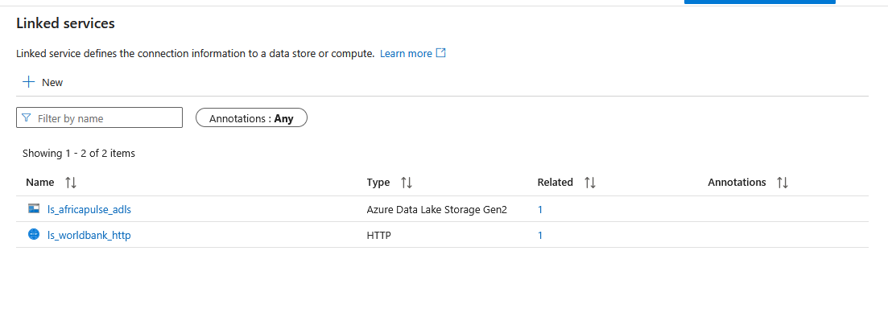

- `ls_worldbank_http` — anonymous auth (the World Bank API is public)
- `ls_africapulse_adls` — writes ingested data to ADLS Gen2

Keeping source and destination as separate, reusable Linked Services keeps the architecture modular change a connection string once, and every dataset/pipeline using it inherits the update.

**Parameterized Datasets:** Rather than building a separate dataset per indicator (GDP, inflation, unemployment), a single HTTP dataset was parameterized with the endpoint passed dynamically a DRY pattern that scales cleanly as more indicators are added.

**Date-Partitioned Ingestion:** A `Load Date` pipeline parameter writes each run into its own dated folder, so historical loads are preserved, nothing is overwritten, and any single day can be reprocessed independently. This is what keeps Bronze truly immutable.

**Master Pipeline with parallel ForEach:**

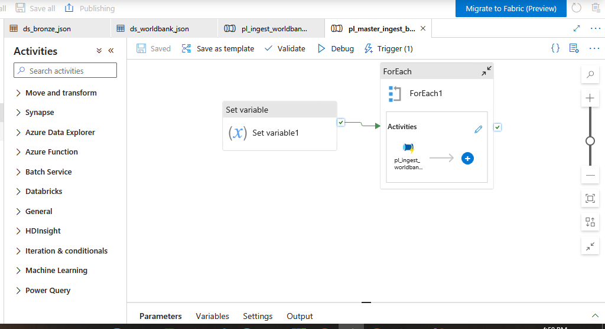

A master pipeline iterates over `[GDP, Inflation, Unemployment]` in a **ForEach** activity configured for **parallel execution** all three API calls fire simultaneously instead of sequentially, trading a bit more Integration Runtime consumption for meaningfully faster runs.

**Verified Bronze landing:**

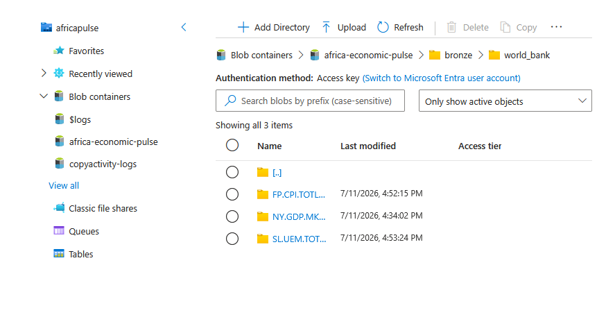

**Debug runs, then scheduled trigger:**

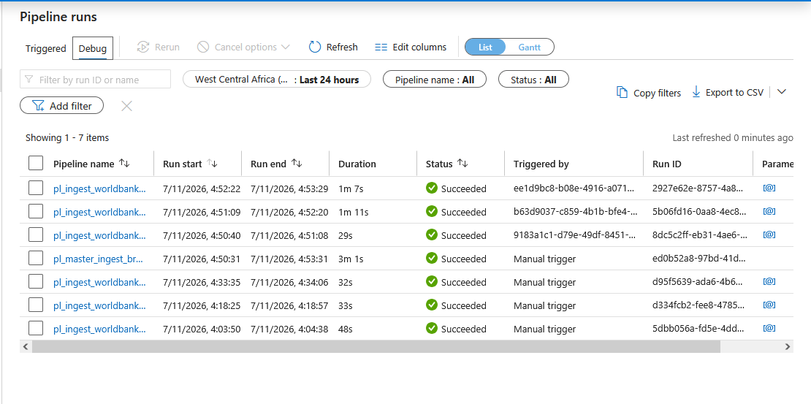

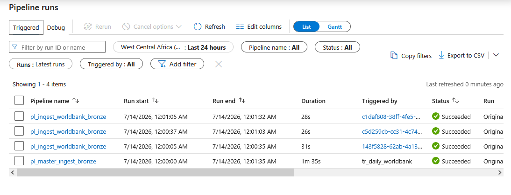

A **Schedule Trigger** runs daily ingestion simpler than a Tumbling Window Trigger, which is better suited to historical backfills and guaranteed window processing. For this project, backfills are handled manually via different `Load Date` values.

**Key lesson — Bronze preserves everything:** Bronze stores *every* country returned by the World Bank API, not just African ones. Filtering at ingestion would permanently discard data recoverable only by re-hitting the source API. Business filtering belongs downstream, in Silver.

**Reliability considerations (documented, not all implemented):** retry count 3, retry interval 30s, Azure Monitor alerts on failure external APIs aren't always available, and production pipelines need to handle transient failures gracefully.

---

## Day 3 — Databricks Silver & Gold Transformation

**Objective:** Turn raw Bronze JSON into cleaned, Africa-only Delta tables, then aggregate into Gold.

**Reading Bronze data:**

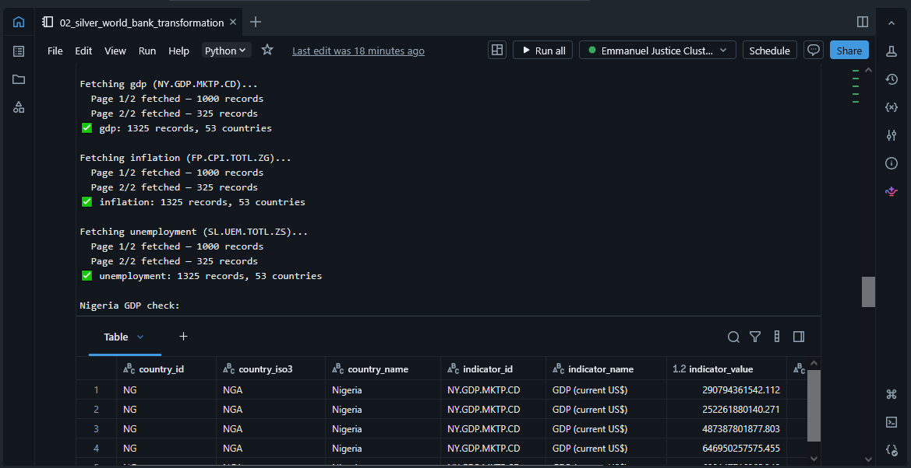

Two Spark options were essential:
- `multiline=true` — the World Bank JSON spans multiple lines per object
- `recursiveFileLookup=true` — reads across every date-partitioned Bronze subfolder automatically

**Parsing the nested structure:** The API returns `[metadata, records[]]`. Spark reads this as a two-element struct, so `explode()` is required to flatten the records array into one row per observation. A single reusable parsing function extracts `indicator_id`, `indicator_name`, `country_id`, `country_name`, `country_iso3`, `year`, and `indicator_value` — applying DRY at the code level, the same way parameterization did in ADF.

**Filtering happens in Silver, not Bronze:** African ISO3 codes are applied here never at ingestion — so the option to reprocess non-African data is never lost.

**Data quality + lineage metadata:** nulls dropped, year cast to int, country names trimmed, plus `ingestion_date`, `pipeline_name`, and `source_system` columns added for traceability.

**Writing Silver as Delta Lake:**

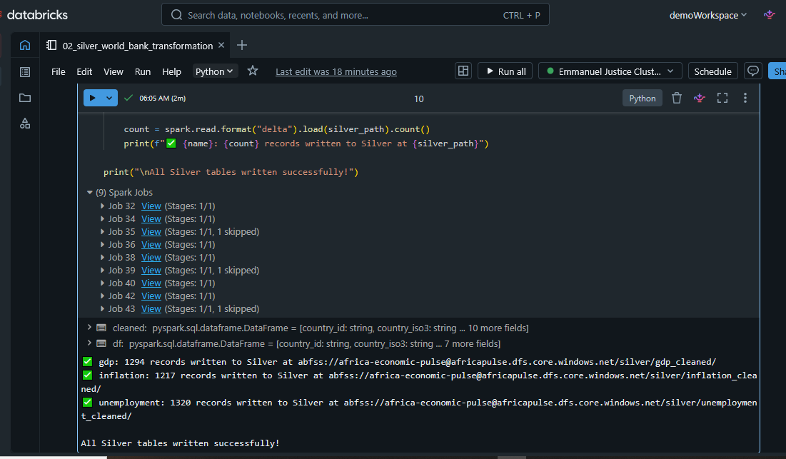

Delta was chosen over plain Parquet for ACID transactions, schema enforcement, time travel, and efficient merge/upsert support all things a production incremental pipeline needs. Tables were partitioned by `year` for partition pruning on time-filtered queries.

**Verifying the Delta log:**

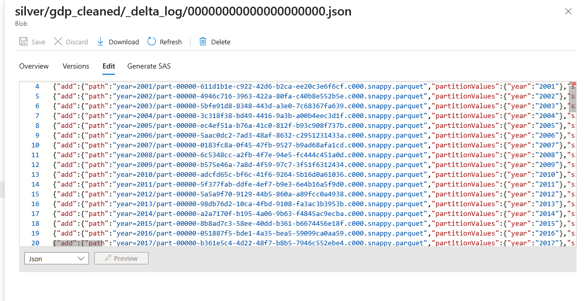

**Writing Gold aggregates:**

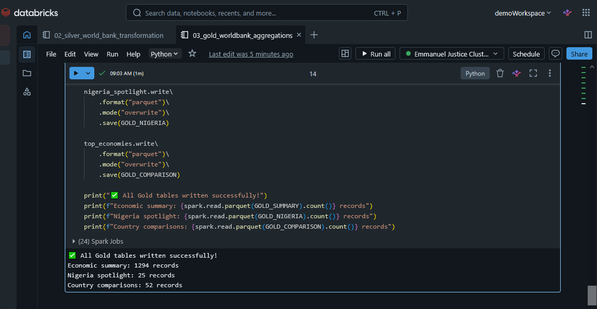

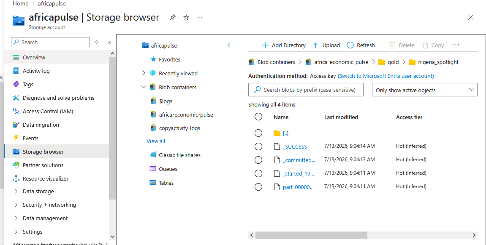

Three Gold datasets were produced: `economic_summary`, `nigeria_spotlight`, and `country_comparisons` each written as Parquet for Synapse Serverless to query directly.

**A mid-project correction:** Gold tables were initially written with `partitionBy("year")`. Synapse external tables read file *content* only — they don't infer values from folder names so every `year` column came back `null`. The fix: drop `partitionBy` in Gold, since at ~1,300 records partitioning adds complexity with no real performance benefit (that trade-off only pays off at millions of rows).

---

## Azure Synapse Analytics — Serving Layer

**Why Serverless SQL over Dedicated:** Serverless queries Parquet directly in ADLS with no data duplication and no ETL into a warehouse, billing per TB scanned. For a small, ad-hoc BI workload this costs next to nothing. Dedicated Pool would be reconsidered for high-concurrency production dashboards.

**Authentication chain:** Managed Identity (no secret rotation needed) → Master Key (encrypts credentials at rest) → Database Scoped Credential → External Data Source → External File Format (Parquet, Snappy compression for fast decompression on read-heavy analytical queries).

**External table definition:**

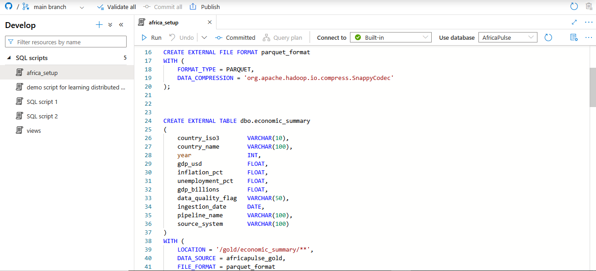

External tables are metadata-only — they point at existing Parquet files and define a schema for reading them; dropping the table never touches the underlying data.

**Querying the results:**

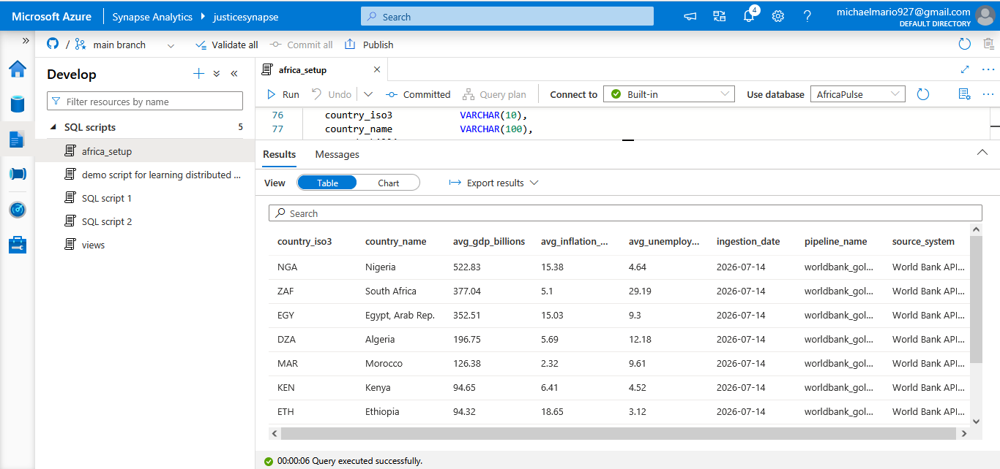

**Four views built as the Power BI-facing layer** (`vw_top10_economies`, `vw_nigeria_trend`, `vw_latest_snapshot`, `vw_economic_trends`) — encapsulating filtering and business logic so Power BI just visualizes, and future rule changes only touch the view, not the report.

A `data_quality_flag = 'complete'` filter initially excluded Nigeria and South Africa (they had gaps in inflation or unemployment for some years). The fix was filtering on the primary metric (`gdp_billions IS NOT NULL`) instead — World Bank data has natural reporting gaps, and Power BI handles nulls gracefully.

A dedicated, least-privilege SQL login (`AfricaPulseUser`) was created for Power BI rather than reusing admin credentials.

---

## Power BI Dashboards

**Connection:** Power BI Desktop → Synapse Serverless via SQL login, **Import** mode (chosen over DirectQuery since the dataset is small and refreshed daily, not real-time).

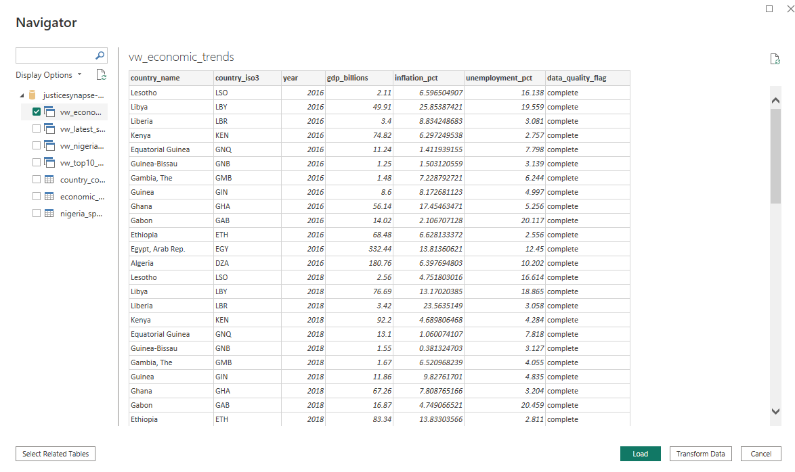

> **Note:** Personal (Gmail-based) Microsoft accounts aren't accepted for direct Azure AD connections in Power BI Desktop a dedicated SQL login sidesteps this entirely.

**Data model:** Four views loaded, each self-contained per dashboard page (no relationships needed), internal metadata columns hidden, and fields renamed for readability (`gdp_billions` → *GDP (Billions USD)*, etc.).

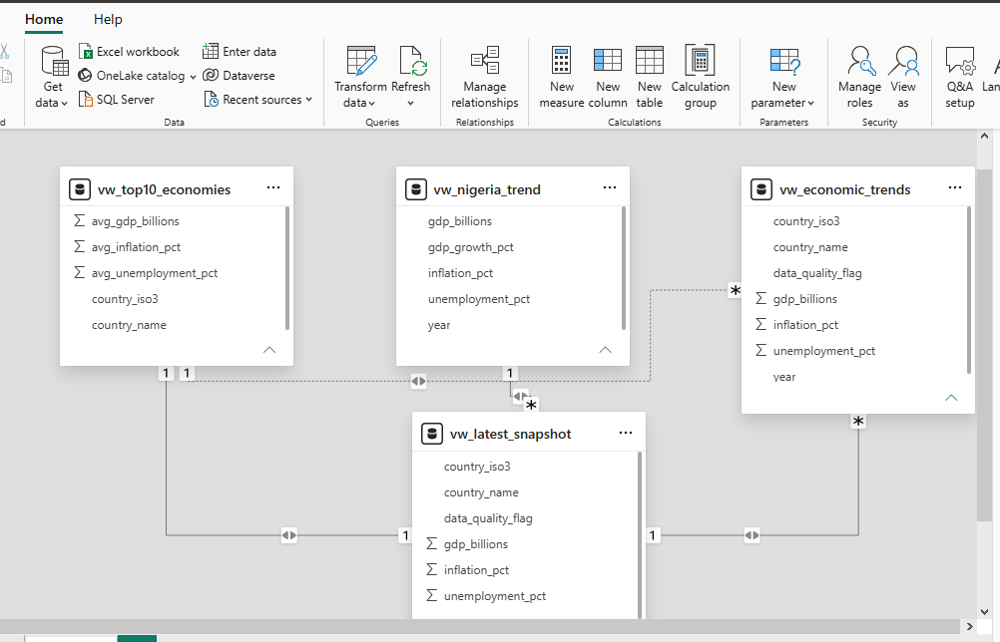

### Dashboard 1 — African Economic Overview
*How is Africa performing as a continent?*

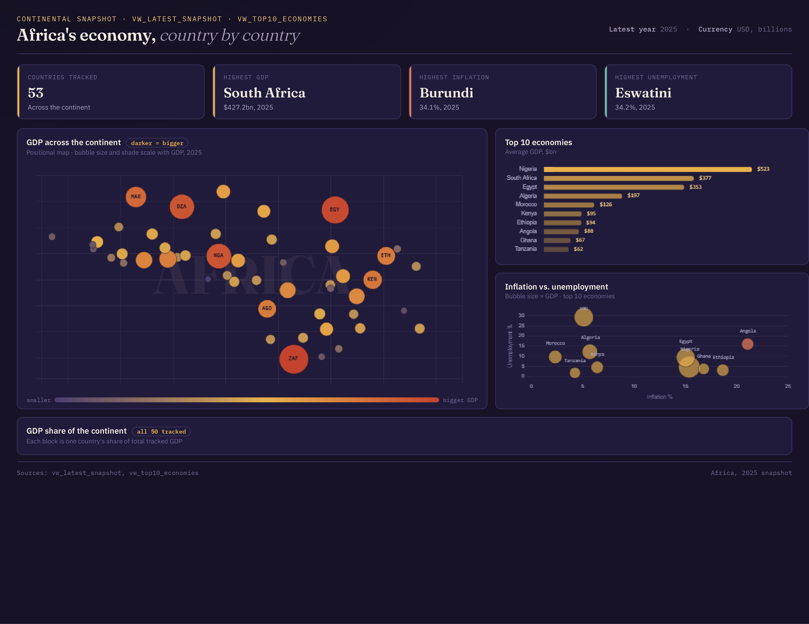

Map by GDP size, top-10 economies bar chart, inflation-vs-unemployment bubble chart, KPI cards, and a GDP-share treemap.

### Dashboard 2 — Nigeria Spotlight
*How has Nigeria's economy evolved over 25 years?*

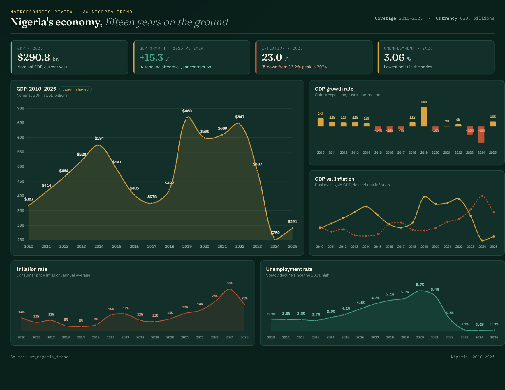

GDP trend 2010–2025, year-over-year growth rate, inflation and unemployment trend lines, KPI cards, and a dual-axis GDP-vs-inflation chart.


---

## Microsoft Purview — Data Governance

Purview was added as the governance layer — answering *what data exists, where it came from, who can access it,* and *what it means* on top of the pipeline itself. This is deliberately included to demonstrate awareness of enterprise data management beyond pipeline-building alone.

**Fixing scan authentication:** The initial scan failed with `AuthorizationPermissionMismatch`. Purview's Managed Identity needed its own RBAC grant — but only **Storage Blob Data Reader** (not Contributor), since scanning is read-only and least privilege applies here too.

**Asset catalogue after a successful scan:**

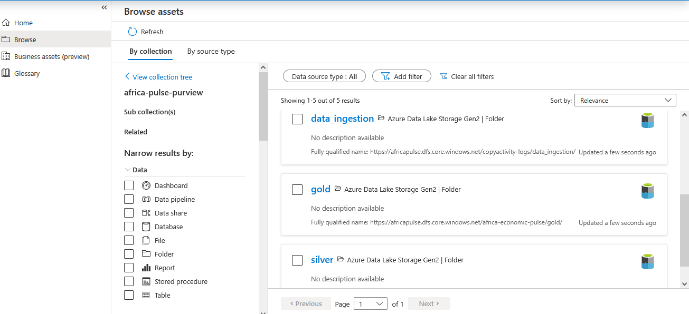

**Registered data sources:**

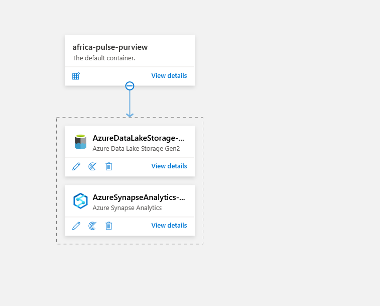

**Lineage — a known gap:** Automatic lineage only works for specific Azure integrations. ADF's Copy Activity reports lineage automatically once connected to Purview; Databricks notebook lineage requires explicit Apache Atlas REST API calls, which weren't implemented here due to time constraints.

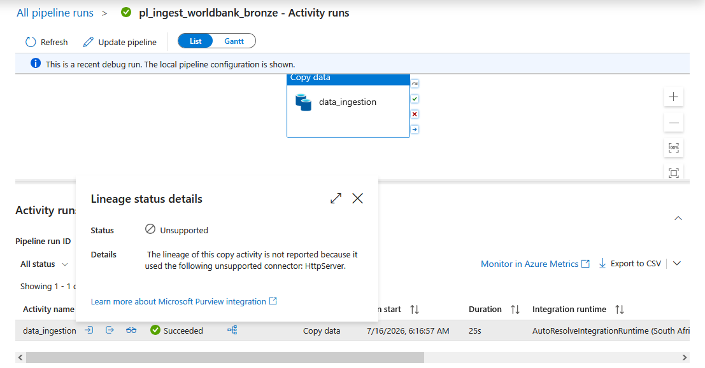

ADF was still connected to Purview so Bronze ingestion lineage reports automatically full Bronze→Silver→Gold lineage via the Atlas API is noted as a production enhancement.

---

## Azure Monitor & Log Analytics

A pipeline running without monitoring is incomplete Log Analytics was connected to ADF with diagnostic settings capturing pipeline runs, activity runs, and trigger runs.

**Three KQL queries** were written and validated:

```kql
// 1. Failed pipeline activities — first query when investigating a failure
ADFSandboxActivityRun
| where Status == "Failed"
| project TimeGenerated, PipelineName, ActivityName, FailureType, ErrorMessage
```

```kql
// 2. Storage operations — debugging data access issues
StorageBlobLogs
| project TimeGenerated, OperationName, Uri, StatusCode
| order by TimeGenerated desc
```

```kql
// 3. Log table inventory — first query when exploring a new workspace
search *
| summarize Count=count() by $table
| order by Count desc
```

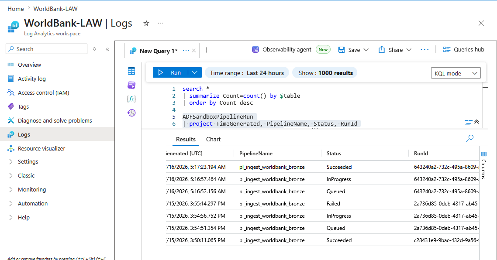

All three were verified by intentionally breaking the World Bank API URL in the ADF Linked Service and confirming the failure surfaced correctly.

An email alert rule for pipeline failures was configured but didn't fire during testing the underlying log data was confirmed correct via KQL, so the gap was isolated to alert/action-group delivery configuration, not data collection. Documented as an open item rather than silently dropped.

---

## GitHub & Version Control

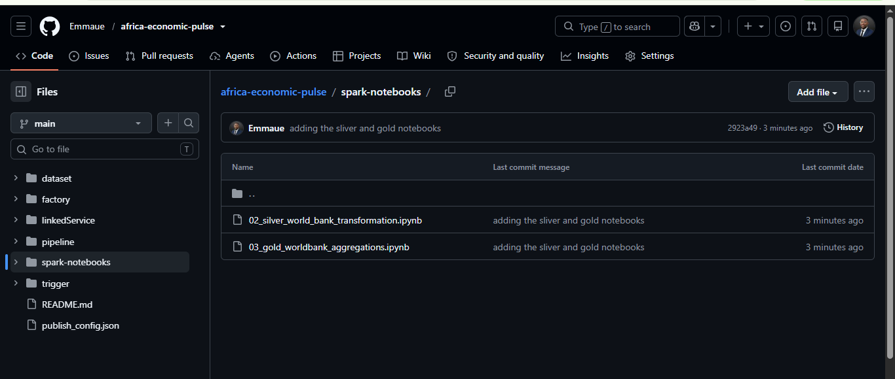

Both **ADF** and **Databricks** are connected to the same GitHub repository:

- **ADF:** branch-based workflow `Save All` commits to the working branch, `Publish` deploys to live ADF and generates an `adf_publish` branch with deployment ARM templates.
- **Databricks:** connected via Personal Access Token; notebooks committed and pushed from the Databricks Git panel.

**A near-miss with secrets:** an early push containing hardcoded Service Principal credentials was correctly rejected by GitHub's secret scanning. The response was to *rotate the secret immediately in Azure App Registration* not to try to scrub Git history, since anything that reached Git is treated as compromised regardless of whether the push succeeded.

**Fix — Databricks Secret Scope:**

```bash
databricks secrets create-scope --scope africa-pulse-scope
databricks secrets put --scope africa-pulse-scope --key client-secret
databricks secrets put --scope africa-pulse-scope --key client-id
databricks secrets put --scope africa-pulse-scope --key tenant-id
```

```python
client_id = dbutils.secrets.get(scope="africa-pulse-scope", key="client-id")
```

Secrets retrieved this way never render in notebook output, execution logs, or Git history the Databricks equivalent of `.env` files or Key Vault.

---

## Key Learnings & Mental Models

- **The RBAC pattern repeats everywhere:** *Service A needs Resource B → grant Service A's Managed Identity the minimum role on B via IAM.* This single pattern solved ADF→ADLS, Databricks→ADLS, Synapse→ADLS, and Purview→ADLS.
- **Dependency chains must be respected:** external tables → data sources → credentials → master key; datasets → linked services. Always map dependencies before restructuring.
- **Databricks cluster restarts clear memory** OAuth config, path variables, and DataFrames are all lost. Production fixes this with Secrets + Jobs; here, the auth and paths cells are simply re-run after any restart.
- **Bronze immutability is non-negotiable** — it stores all 200+ countries even though only ~54 African countries are ultimately needed, because filtering is Silver's job, not Bronze's.
- **Every decision has three dimensions:** cost, complexity, and reliability. Weighing all three not just "does it work" is what separates senior engineering judgment from junior implementation.

---

## Mistakes Made (and Fixed)

| Issue | Root Cause | Fix |
|---|---|---|
| ADF wrote to the wrong container | Linked Service didn't specify the intended file system | Corrected the Linked Service configuration |
| Debug runs didn't reflect in production | Debugging only runs pipelines temporarily | Learned to always **Publish** before relying on triggers |
| `year` returned `null` in Synapse | Gold Parquet was written with `partitionBy("year")`; partition values live in folder names, not file content | Removed `partitionBy` from Gold writes |
| Nigeria/South Africa missing from views | `data_quality_flag = 'complete'` required all 3 indicators present | Filtered on `gdp_billions IS NOT NULL` instead |
| Couldn't drop a Synapse external data source | Dependent external tables still referenced it | Drop child objects before parents (tables → data source → credential) |
| `ORDER BY` in a view definition failed | Views aren't ordered result sets in SQL Server | Removed `ORDER BY`; ordering handled at query/visual layer |
| Purview scan failed (`Forbidden`) | Purview's Managed Identity had no storage role | Granted **Storage Blob Data Reader** (least privilege) |
| Lineage showed "Not Available" | Databricks notebooks weren't reporting to Purview's Atlas API | Connected ADF↔Purview for Copy Activity lineage; full notebook lineage flagged as a future enhancement |
| Nearly pushed hardcoded credentials to GitHub | Secrets left in notebook code | Git secret scanning blocked it; rotated the secret immediately, then implemented Databricks Secret Scope |
| Failure alert email never arrived | Suspected action-group/email misconfiguration | Confirmed data collection was correct via KQL; alert delivery left as a documented open item |

---

## Production Enhancements (Not Implemented Here)

- Separate Dev/Test/Staging/Prod environments for ADF, Databricks, and Synapse, with Pull Request review gating production deployment
- API keys and secrets in Azure Key Vault (not just Databricks Secret Scope)
- Full Bronze→Silver→Gold lineage via Purview's Atlas REST API / Python SDK
- Delta `MERGE` (upsert) instead of overwrite for incremental Silver processing
- Retry policies (3 attempts, 30s interval) and Azure Monitor alerts wired into every pipeline
- Slack/Teams webhook alerting with severity-based routing, plus SLA-duration alerts (not just failure alerts)
- Zone- or Geo-redundant storage (ZRS/GRS) depending on business continuity requirements

---

## Repository Structure

```
africa-economic-pulse/
├── dataset/              # ADF dataset definitions
├── factory/               # ADF factory-level settings
├── linkedService/          # ADF Linked Services (HTTP, ADLS Gen2)
├── pipeline/               # ADF pipelines (ingestion + master ForEach)
├── trigger/                # Schedule trigger definitions
├── spark-notebooks/
│   ├── 02_silver_world_bank_transformation.ipynb
│   └── 03_gold_worldbank_aggregations.ipynb
├── images/                 # Screenshots referenced in this README
├── README.md
└── publish_config.json
```

---

## About This Project

Built as a portfolio project to demonstrate end-to-end Azure data engineering: ingestion, transformation, serving, visualization, governance, and observability — with every decision and mistake documented, not just the polished result.
